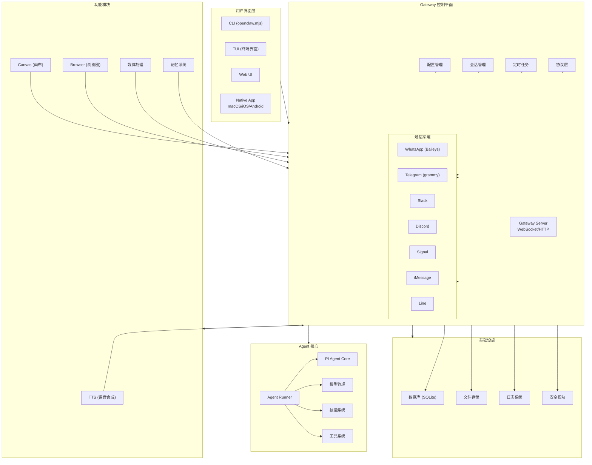
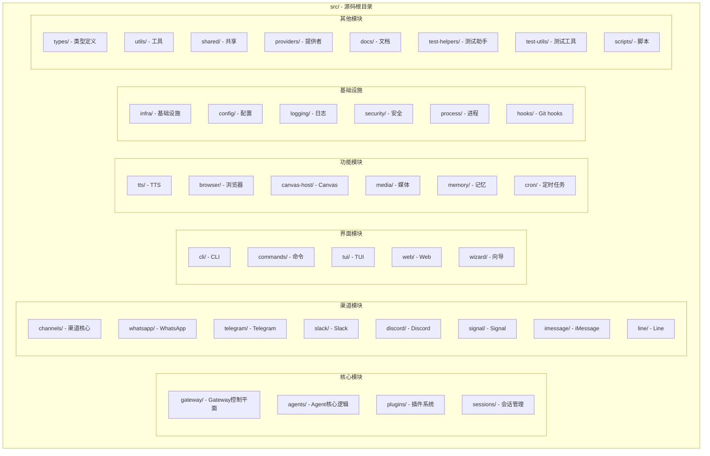
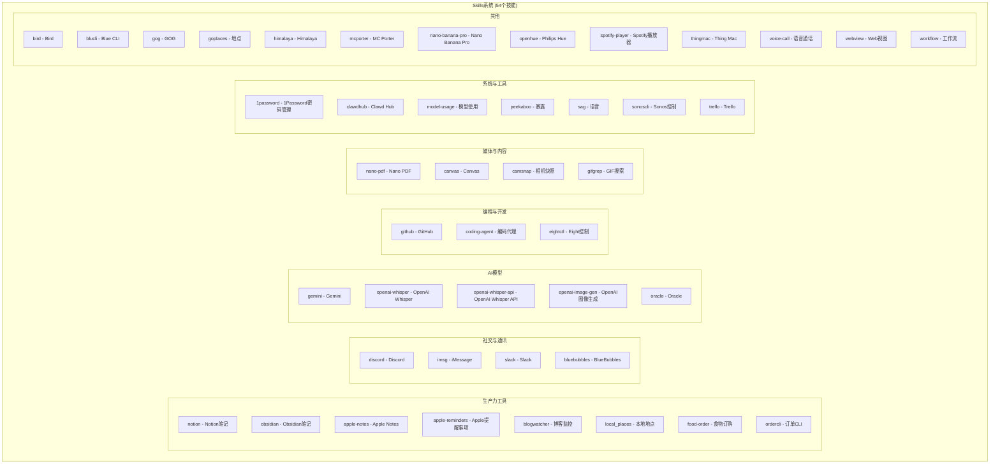
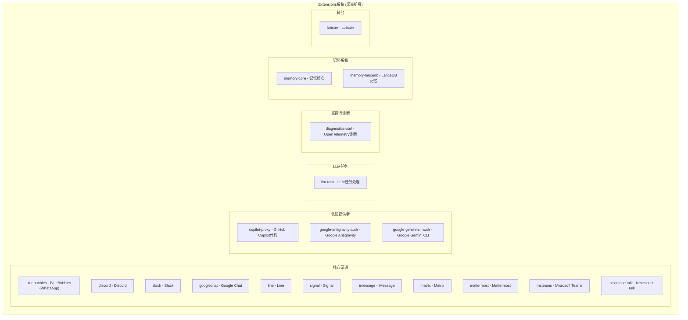
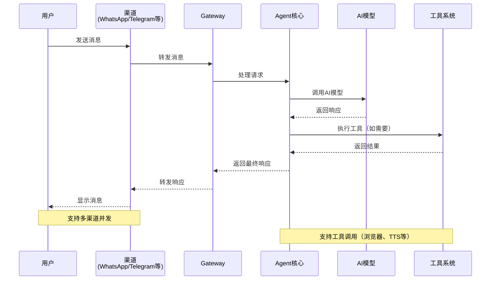
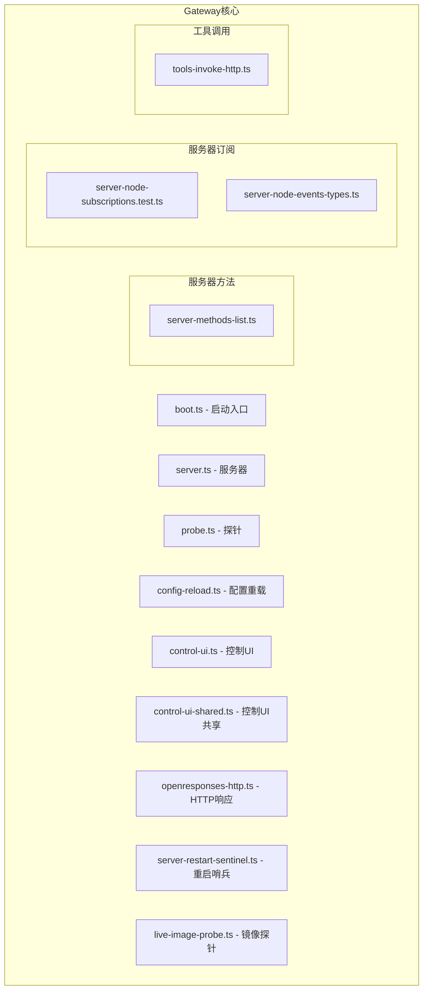
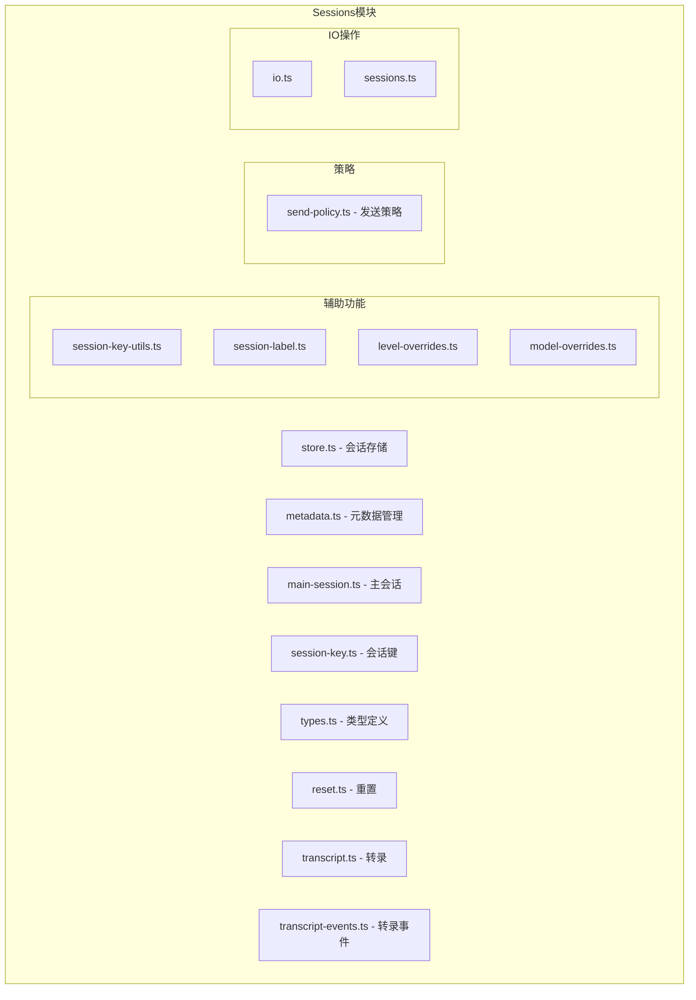
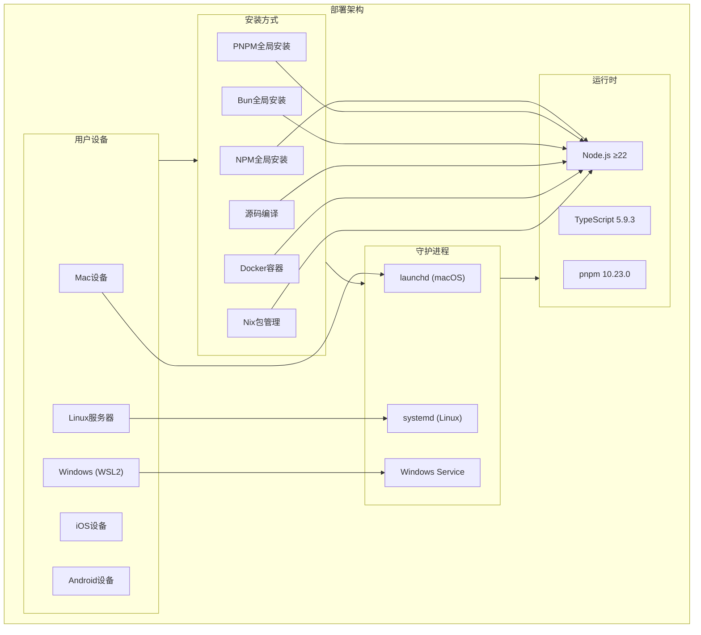

# OpenClaw 项目架构 - Mermaid 图表

生成时间：2026-01-31 00:53
进度：第5次汇报

## 项目概览

OpenClaw 是一个个人AI助手系统，核心特点是：
- 多渠道支持（WhatsApp, Telegram, Slack, Discord, Google Chat, Signal, iMessage等）
- Gateway控制平面 + Agent助手产品的架构
- 支持TTS（语音合成）、Canvas（画布）、浏览器控制等功能
- 支持本地运行，模型可配置（Anthropic, OpenAI等）

---

## 1. 整体架构图

---

## 2. 源码目录结构图

---

## 3. 协议层架构图

```mermaid
flowchart TB
    subgraph Protocol["Gateway协议层"]
        subgraph ProtocolSchemas["协议Schema定义"]
            frames["frames.ts - 帧协议"]
            agent["agent.ts - Agent相关"]
            channels["channels.ts - 渠道相关"]
            config["config.ts - 配置相关"]
            cron["cron.ts - 定时任务"]
            devices["devices.ts - 设备配对"]
            sessions["sessions.ts - 会话相关"]
            nodes["nodes.ts - 节点相关"]
            exec_approvals["exec-approvals.ts - 执行审批"]
            snapshot["snapshot.ts - 快照"]
            wizard["wizard.ts - 向导"]
            logs_chat["logs-chat.ts - 聊天日志"]
            types["types.ts - 类型聚合"]
            protocol_schemas["protocol-schemas.ts - 协议聚合"]
            agents_models_skills["agents-models-skills.ts - Agent/模型/技能"]
            primitives["primitives.ts - 基础类型"]
            error_codes["error-codes.ts - 错误码"]
        end
    end
```

---

## 4. Skills系统架构图

---

## 5. Extensions系统架构图

---

## 6. 数据流图

---

## 7. Gateway核心文件结构图

---

## 8. Config模块文件结构图

```mermaid
flowchart TD
    subgraph ConfigModule["Config模块"]
        config["config.ts - 配置核心"]
        schema["schema.ts - 配置Schema"]
        paths["paths.ts - 路径配置"]
        defaults["defaults.ts - 默认配置"]
        validation["validation.ts - 配置验证"]

        subgraph Types["类型定义"]
            types_channels["types.channels.ts"]
            types_models["types.models.ts"]
            types_skills["types.skills.ts"]
            types_agents["types.agents.ts"]
            types_plugins["types.plugins.ts"]
            types_whatsapp["types.whatsapp.ts"]
            types_telegram["types.telegram.ts"]
            types_discord["types.discord.ts"]
            types_slack["types.slack.ts"]
            types_signal["types.signal.ts"]
            types_imessage["types.imessage.ts"]
            types_googlechat["types.googlechat.ts"]
            types_msteams["types.msteams.ts"]
            types_tts["types.tts.ts"]
            types_tools["types.tools.ts"]
            types_browser["types.browser.ts"]
            types_sandbox["types.sandbox.ts"]
            types_gateway["types.gateway.ts"]
            types_queue["types.queue.ts"]
            types_auth["types.auth.ts"]
            types_messages["types.messages.ts"]
            types_hooks["types.hooks.ts"]
            types_base["types.base.ts"]
            types_openclaw["types.openclaw.ts"]
        end

        subgraph ZodSchema["Zod Schema"]
            zod_schema["zod-schema.ts"]
            zod_schema_channels["zod-schema.channels.ts"]
            zod_schema_agents["zod-schema.agents.ts"]
            zod_schema_agent_runtime["zod-schema.agent-runtime.ts"]
            zod_schema_session["zod-schema.session.ts"]
            zod_schema_providers["zod-schema.providers.ts"]
            zod_schema_providers_core["zod-schema.providers-core.ts"]
            zod_schema_providers_whatsapp["zod-schema.providers-whatsapp.ts"]
            zod_schema_hooks["zod-schema.hooks.ts"]
            zod_schema_core["zod-schema.core.ts"]
            zod_schema_approvals["zod-schema.approvals.ts"]
            zod_schema_agent_defaults["zod-schema.agent-defaults.ts"]
        end

        subgraph Helpers["辅助功能"]
            merge_config["merge-config.ts"]
            merge_patch["merge-patch.ts"]
            includes["includes.ts"]
            normalize_paths["normalize-paths.ts"]
            env_substitution["env-substitution.ts"]
            cache_utils["cache-utils.ts"]
        end

        subgraph Legacy["遗留支持"]
            legacy["legacy.ts"]
            legacy_shared["legacy.shared.ts"]
            legacy_migrate["legacy-migrate.ts"]
            legacy_migrations["legacy.migrations.ts"]
            legacy_rules["legacy.rules.ts"]
        end
    end
```

---

## 9. Sessions模块文件结构图

---

## 10. 部署架构图

---

## 总结

已创建10个详细的Mermaid架构图，完整覆盖OpenClaw项目的各个方面：
1. 整体架构图 - 系统层级关系
2. 源码目录结构图 - 52个源码目录组织
3. 协议层架构图 - 17个协议Schema
4. Skills系统架构图 - 54个技能分类
5. Extensions系统架构图 - 20+个扩展分类
6. 数据流图 - 消息流转过程
7. Gateway核心文件结构图 - 核心模块文件
8. Config模块文件结构图 - 配置系统详细结构
9. Sessions模块文件结构图 - 会话管理系统
10. 部署架构图 - 多平台部署方案

所有架构文档已保存至 `/home/admin/clawd/openclaw-architecture.md`
